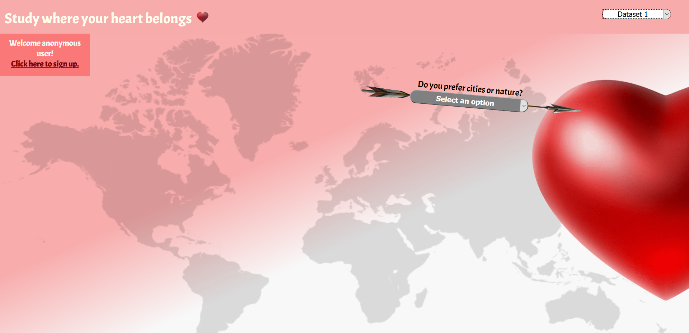
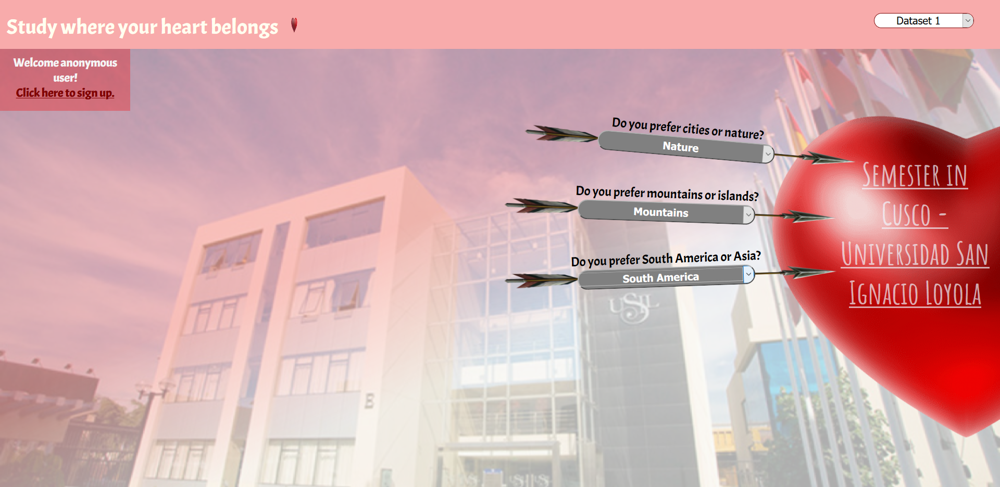
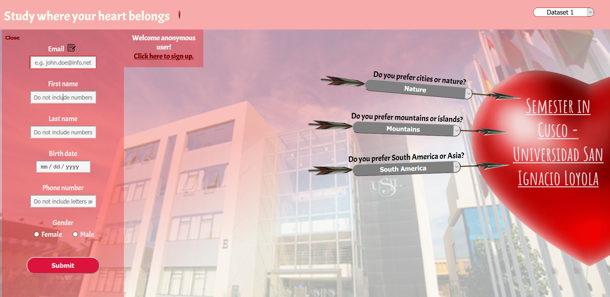
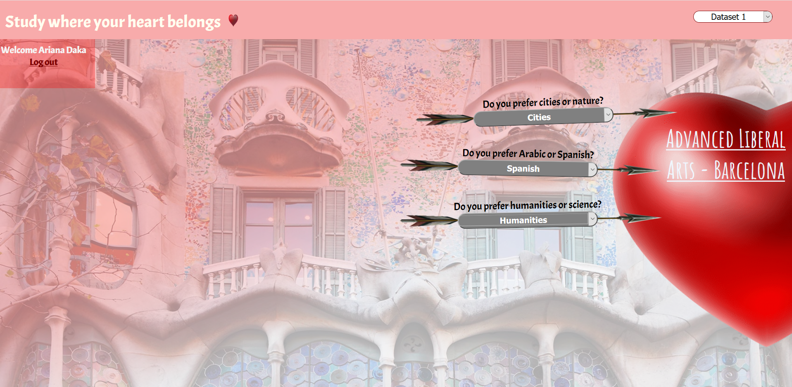

# RIT_study_abroad
A single web application that suggests RIT study abroad programs based on user's selections, with a Valentine's day theme. There are two sets of data that are read from two JSON files. The depth of the selection is three levels with each selection having at least three options. The selection options are presented in an arrow that are animated to move from left to right, into the heart. <b>It gives an effect of shooting arrows into the heart!</b>

1. User is presented with one selection option initially:

2. Based on the choices, the user is opted with the next selection:

3. After the user chooses the third option, they are presented with the result in form of a link in the heart, which redirects to the program's website:

4. Additionally, users can sign up, after which their selections are tracked via localstorage:

5. The next time the user signs in via their email address, they are presented with their previously selected options:

